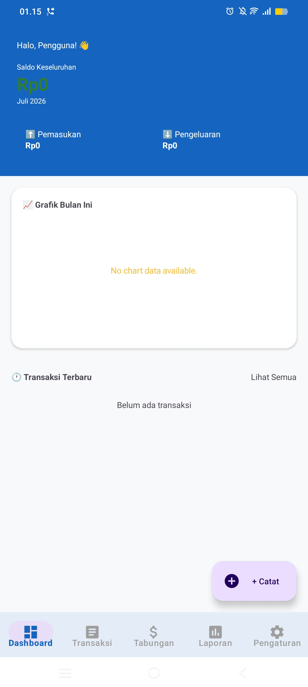
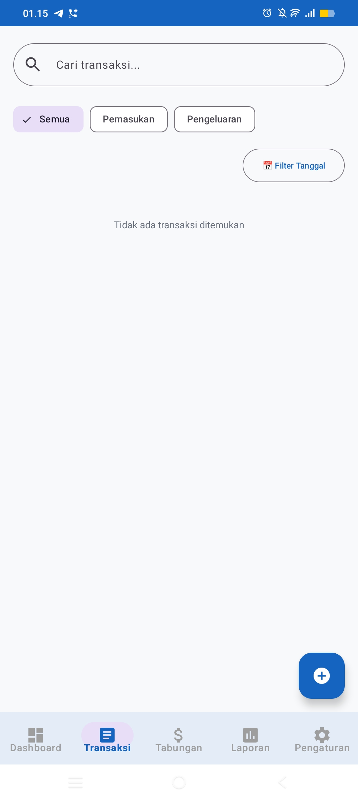
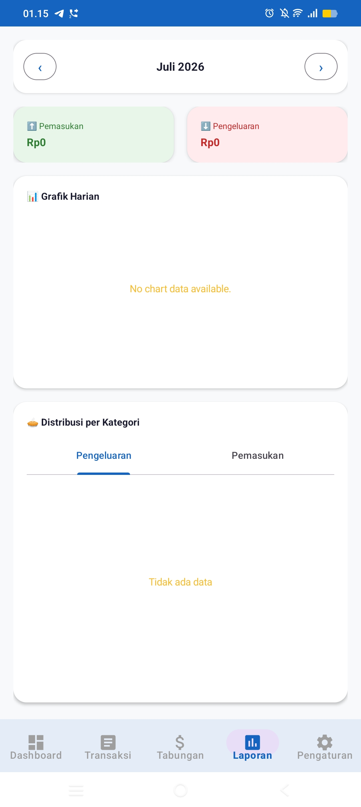
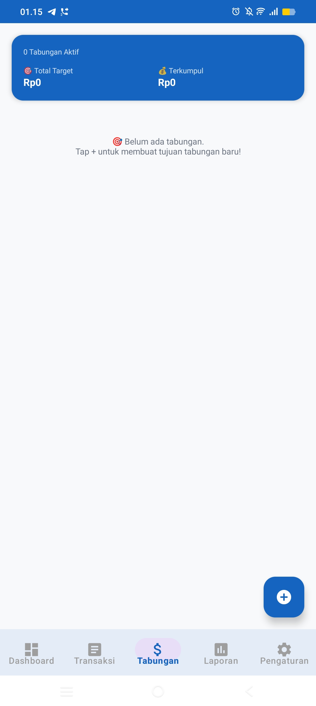
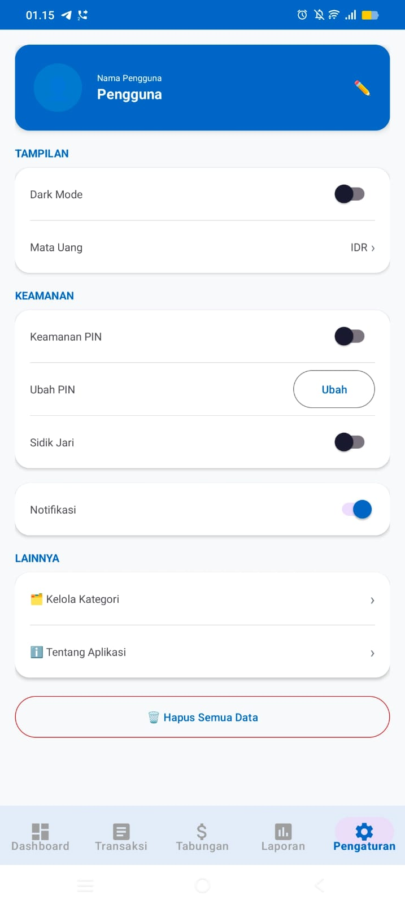
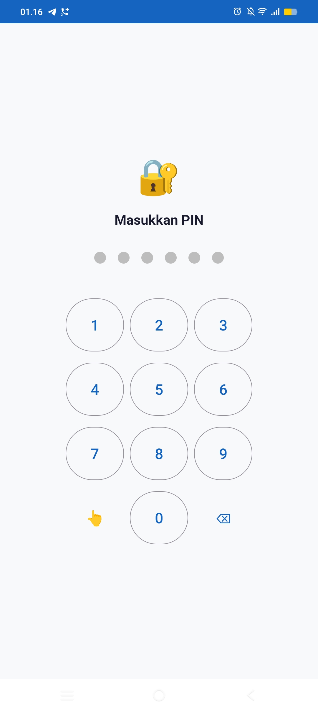

# 💰 Catatan Keuangan

Aplikasi manajemen keuangan pribadi berbasis **Android Native (Java)** untuk mencatat transaksi, mengatur budget, menabung menuju target finansial, dan memantau laporan keuangan lewat grafik interaktif — semua tersimpan lokal di perangkat, cepat, dan aman.


---

## 📖 Latar Belakang

Mengelola keuangan pribadi sering kali merepotkan jika masih dilakukan manual di buku catatan atau spreadsheet. **Catatan Keuangan** dibangun untuk menjawab masalah ini — sebuah aplikasi Android native yang ringan, bekerja sepenuhnya offline, dan menyimpan seluruh data secara lokal di perangkat pengguna sehingga privasi tetap terjaga.

## 🎯 Tujuan

- Memudahkan pencatatan pemasukan dan pengeluaran harian
- Membantu mengatur budget per kategori agar pengeluaran lebih terkontrol
- Memfasilitasi perencanaan tabungan dengan target dan progres yang terukur
- Menyajikan laporan keuangan visual agar pola keuangan mudah dipahami
- Melindungi data finansial pengguna dengan keamanan berlapis

## ✨ Fitur Utama

| Fitur | Deskripsi |
|---|---|
| 🏠 **Dashboard** | Ringkasan saldo, pemasukan/pengeluaran bulanan, dan grafik tren keuangan |
| 💳 **Transaksi** | Tambah, edit, cari, dan filter transaksi berdasarkan kategori & tanggal |
| 🗂️ **Kategori** | Kelola kategori transaksi secara custom |
| 💰 **Budget** | Atur anggaran per kategori untuk mengontrol pengeluaran |
| 🎯 **Tabungan** | Buat target tabungan, catat setoran, pantau progres |
| 📊 **Laporan** | Grafik harian & distribusi kategori pemasukan/pengeluaran |
| 🔔 **Pengingat** | Notifikasi otomatis untuk mengingatkan pencatatan transaksi |
| 🔒 **Keamanan** | Kunci PIN 6 digit + login sidik jari (biometric) |
| 🌙 **Personalisasi** | Dark Mode & pengaturan mata uang |

## 🛠️ Teknologi yang Digunakan

- **Bahasa:** Java
- **Arsitektur:** MVVM (Model-View-ViewModel) + Repository Pattern
- **Database:** [Room](https://developer.android.com/training/data-storage/room) — persistence library Android Jetpack untuk penyimpanan data lokal berbasis objek (Entity, DAO)
- **UI:** ViewBinding, Material Design Components, ConstraintLayout
- **Navigasi:** Navigation Component (single-activity, multi-fragment)
- **Grafik:** [MPAndroidChart](https://github.com/PhilJay/MPAndroidChart)
- **Keamanan:** AndroidX Biometric
- **Background Task:** WorkManager & AlarmManager (pengingat/notifikasi)
- **Reactive Data:** LiveData & ViewModel (Android Jetpack)

## 🏗️ Struktur Proyek

```
app/src/main/java/com/vella/catatankeuangan/
├── data/
│   ├── dao/            # Data Access Object (Room)
│   ├── database/        # AppDatabase
│   ├── entity/           # Entity: Transaksi, Kategori, Budget, Tabungan, Pengingat
│   └── repository/      # Repository layer
├── ui/
│   ├── dashboard/        # Dashboard
│   ├── transaksi/        # Tambah/Edit/List Transaksi
│   ├── kategori/         # Kelola Kategori
│   ├── tabungan/         # Tabungan & Target
│   ├── laporan/          # Laporan & Grafik
│   ├── pengaturan/       # Pengaturan Aplikasi
│   ├── PinActivity.java
│   └── SplashActivity.java
└── utils/                 # AlarmReceiver, AppPreferences, CurrencyUtils, NotificationHelper
```

## 🚀 Instalasi & Menjalankan Proyek

### Prasyarat
- [Android Studio](https://developer.android.com/studio) (terbaru)
- JDK 11+
- Android SDK (minSdk 24, targetSdk 36)

### Langkah-langkah

```bash
# Clone repository
git clone https://github.com/Vellaapril/catatan-keuangan.git

# Masuk ke folder proyek
cd catatan-keuangan

# Buka dengan Android Studio, lalu sync Gradle
```

Atau build lewat command line:

```bash
./gradlew assembleDebug
```

APK hasil build akan tersedia di `app/build/outputs/apk/debug/`.

## 📱 Screenshot

| Dashboard | Transaksi | Laporan |
|---|---|---|
|  |  |  |

| Tabungan | Pengaturan | Kunci PIN |
|---|---|---|
|  |  |  |

## 💡 Manfaat

Dengan Catatan Keuangan, pengguna dapat lebih disiplin mengatur arus kas harian, memahami ke mana saja uang mereka mengalir lewat laporan visual, dan lebih termotivasi mencapai target finansial melalui fitur tabungan yang terukur. Karena berjalan sepenuhnya native dan offline, aplikasi ini menawarkan performa cepat serta privasi data yang lebih terjamin.

## 🗺️ Roadmap

- [ ] Widget saldo di homescreen
- [ ] Multi-akun / multi-dompet

## 🤝 Kontribusi

Kontribusi sangat terbuka! Silakan fork repository ini, buat branch baru, dan ajukan pull request.

```bash
git checkout -b fitur/nama-fitur
git commit -m "Menambahkan fitur X"
git push origin fitur/nama-fitur
```

## 👤 Author

**Vella Aprilia Sari**
Program Studi Teknik Informatika, Universitas Pamulang
GitHub: [@Vellaapril](https://github.com/Vellaapril)

---

⭐ Jangan lupa beri star jika proyek ini bermanfaat!
